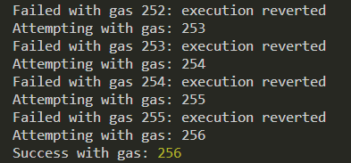
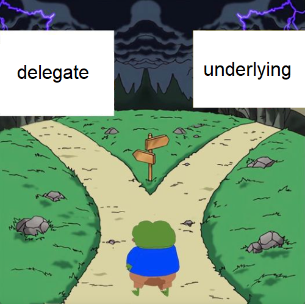

## Overview
Ethernaut solutions using hardhat. `npm install` to install dependencies, then `npx hardhat init` to setup hardhat.


### Hello Ethernaut - 00
1. Goal: Just an introduction to the website getting familiar with the syntax and operations. 
2. Methodology: Play with the consol, calling various properties of the contract and following the steps.
3. Lessons: You can query things about the deployed vulnerable contract in the console. When you click 'get instance', it deploys your very own instance of that vulnerable/target smart contract to the sepolia network (If that's what your metamask is on). If you think you've solved a problem, `submit instance` button has the site check the status of your deployed vulnerable/target smart contract, and if it matches what the end result is, then you passed! 


### Fallback - 01
1. Goal: Take ownership of the contract and withdraw to win.
2. Methodology: 
    - Can be done solely from the console.
    - `await contract.contribute({value: "1"});` Call contribute to make a contribution to the contract.
    - `await sendTransaction({from: "yourWalletAddres", to: "yourContractAddress", value: "1"});` Send a direct transaction to the contract address for 1 wei, this makes the receive fallback function trigger, it checks if the incoming value is greater than zero, and if msg.sender (you) have made a previous contribution, if so you become the owner.
    - `await contract.withdraw();` You can call this function now that you are the owner.
3. Lessons: 
    - Be wary of fallback functions, as they are triggered whenever incoming ether tries to be sent to your address. 
    - Be strict in who you allow to be an owner.


### Fallout - 02
1. Goal: Become owner of the contract.
2. Methodology: 
    - `await contract.Fal1out()`
    - Can be done solely from the console. 
3. Lessons: In solidity v6, the constructor was actually just seen as a function with the same name as the contract. If you misspell the name of your constructor function, it can be called like a normal function!


### Coin Flip - 03
1. Goal: 'Guess' correct outcome of a 'randomly' generated coinflip 10 times in a row in a smart contract.
2. Methodology:
    - Interface with the target contract, grab its flip function. Create the myGuess function which always matches the targets calculation of randomness.
    - Inside our own flip function, set our guess and require it matches before returning.
    - Deploy `CoinFlipHack` with `npx hardhat run scripts/deployCoinFlipHack.js --network sepolia`
    - Create a script to flip the coin 10 times and run with `npx hardhat run scripts/CoinFlipHack.js --network sepolia`
3. Lessons: 
    - You must be careful in how you derive randomness in your contracts. Remember, they are a completely transparent and deterministic system, so randomness must be achieved off-chain in some capacity, and brought in. One solution is chainlink VRF (verifiable random function). 
    - You can pass in other contract addresses during deployment so functions know where the target/vulnerable contract is on chain. 
    - You can interface with other contracts functions with the interface keyword.


### Telephone - 04
1. Goal: Claim ownership of contract
2. Methodology: Interface into Telephone, invoke it's changeOwner function.
3. Lessons: 
    - tx.origin != msg.sender. 
    - tx.origin is the original sender who started the chain of events, it's always the EOA (externally owned account). 
    - msg.sender is the immediate last caller, which could be an EOA or a smart contract.


### Token - 05
1. Goal: Get more than your initial 20 tokens.
2. Methodology: 
    - 0 - 1 = underflow, which becomes maximum uint, breaking the require check.
    - This allows the transfer function to send us the value we passed in during deployment
3. Lessons:
    - Solidity v6 SafeMath isn't enabled, so we can perform overflow/underflows without any errors.


### Delegation - 06
1. Goal: Become owner of `Delegation` contract.
2. Methodology: 
    - Load interface of `Delgate` contract at the address of `Delegation` contract.
    - Trigger fallback function which calls `delegatecall` funciton, which executes the code inside of `Delegate`, which will execute the function `pwn`, BUT it will update the state variable inside of `Delegation` and not `Delegate`.
    - state variable 'owner' of `Delegation` is updated to us.
    
3. Lessons:
    - When a contract A calls `delegatecall` to a function in contract B, the code of contract B gets executed, but it operates on the storage of contract A.
    - If someone calls a function that exists in the `Delegate` contract but not in the `Delegation` contract, the function will be executed in the `Delegate` contract but operate on the storage of the `Delegation` contract.
    - The key here is we create an instance of `Delegation` using the ABI from `IDelegate`.
    - Metamask always fails to guess the gas right, therefore you need to pass in a custom gas amount. ethers v6 uses `toBeHex` instead of `hexlify`!!!


### 07 - Force
1. Goal: Make the balance of the empty target contract greater than zero. 
2. Methodology: 
    -The problem is that the target contract is empty. Usually it needs a payable fallback or receive method, or some function that is payable. This target contract is a completely emptry contract with no methods, so how are we supposed to 'pay' into it?
    - Create a contract, pass in target address and some eth on deployment, and immediately self destruct it.
3. Lessons: 
    - `selfdestruct` destroys itself and forcibly sends its eth to another contract address. 


### 08 - Vault
1. Goal: Unlock the vault by getting access to the password.
2. Methodology:
    - Simply grab the password with `await web3.eth.getStorageAt(contract.address, 1)`.
    - And then call `contract.unlock('password')`. This makes locked false because the password matches.
3. Lessons:
    - Even though the state variable password is private, it can be seen on the blockchain. Most blockchains are transparent.
    - The second argument in getStorageAt returns the state variables exactly the order they are shown in the contract storage. (0 is the first state variable, 1 is the second, and so on.)


### 09 - King
1. Goal: Become the king by sending more ether to the contract than anyone else, and then stop anyone else from becoming the king.
2. Methodology:
    - Needed to instantiate `KingHack` contract with at least 0.001 ETH, as that is the prize amount that was found via the console using `await web3.eth.getStorageAt(contract.address, 1)`
    - Inside the constructor it automatically interacts with the target address by sending the prize amount.
    - Once the prize amount is sent, `KingHack` contract is the permanent king, because without including a way for the contract to receieve ether, all possible attempts at someone becoming the new king will fail because their transactions will revert, since we can never be paid out.
3. Lessons: 
    - You can make a `transfer` function always fail by not including a fallback, which can make an entire function never return.


### 10 - Reentrance
1. Goal: Take all the ETH in the target contract.
2. Methodology:
    - The target contract's vulnerability happens because it follows a `checks --> interact --> update state` pattern rather than a `checks -> update state -> interact` pattern. Meaning, it interacts (sends the ETH via withdraw) before updating the ledger's state, so it can be re-entered and harrassed since the state isn't changed (balance updated) until after the interaction.
    - Note: `Donate` function in the target contract is more akin to deposit, we first deposit into the target contract, so we can then use the withdraw function to exploit.
    - The chain of events that occur: Our hack contract deposits into the target contract via the donate function. The target contract is like a bank, and now owes us that if we would like to withdraw. We call the withdraw function, which invokes the receive function, which calls the withdraw function again, and so on. 
    - We get away with it because the "bank" updates it's ledger (state) AFTER it already sent the money. And the target contract CANNOT update it's state until the entire external call transfer is complete... But that means the withdraw->receieve loop can run as long as it needs to, cleaning the contract, and leaving it with nothing, before the target contract updates it's ledger and realizes it's pockets are empty.
3. Lessons:
    - The whole idea is the `withdraw` function from `Reentrance` target contract, which is called from our `ReentranceHack` contract, invokes the `ReentranceHack`'s `receive` method, which then calls the `withdraw` function again from `Reentrance`. The `withdraw` function invokes the `receieve` because in order to withdraw, the other contract must receive via a fallback of some sort.


### Elevator - 11
1. Goal: Reach the `top` floor, turning the `Elevator` boolean state variable to true.
2. Methodology:
    - Our `attack` function keeps calling `goTo` from `Elevator`, and reverts unless `top` is true.
    - The `goTo` function takes in a floor number, and first checks to verify that `isLastFloor` is false by calling `isLastFloor` from `building`. 
    - `building` is the contract that called the `goTo` method, which is our `ElevatorHack` contract via the `attack` function.
    - The first call to our `isLastFloor` is false because our counter is not greater than 1. This passes the initial check of the `goTo` function. So it sets the floor, and then immediately checks `isLastFloor` again. Upon calling `isLastFloor` a second time, our function now returns true because the counter is greater than 1. This makes `top` = true, solving the level.
    - Explaining `Building building = Building(msg.sender);`:
        - `Building building` Assigns type `Building` to `building` variable. 
        - `Building(msg.sender)` casts msg.sender to be treated as an instance of the `Building` interface. `msg.sender` is our `ElevatorHack` contract that called `goTo`.
        - We can then call `building.isLastFloor(_floor)` because we've defined that any `building` should have this function.
3. Lessons:  
    - Interfaces define expected behaviors, but implementations of the specific functions could vary. Do not naively assume that these functions will return consistent values! External calls to these functions could return any possible value within the type, in our example multiple calls produced different results like false and then true.
    - Even if you try to include `view` or `pure` function modifier on an interface to prevent state modificators, it's just a mere suggestion. `function isLastFloor(uint) external view returns (bool);` still relies on external contracts to respect that view modifier.
    - If you expect consistent results from an external function, cache the result of the first call and use that for any logic operations.


### Privacy - 12
1. Goal: Unlock the contract by setting `locked` state variable to false.
2. Methodology:
    - Can solve entirely with the console. 
    - In order to satisfy the check to successfully call the `unlock` function, we require a key. The key has to be the 16 byte version of the 3rd index of the 32 byte fixed size `data` array which is of length 3: `key == bytes16(data[2])`.
    - First set deployed instance address to a variable if you like: `instanceAddress = "0x72c8876a96e6a83D9C5E5dC9E11d0E64E230A819"`
    - `data[2]` is housed on chain in storage slot index 5:  `data = await web3.eth.getStorageAt(instanceAddress, 5)`
        - data example: "0x7d6c54b37a85017f180f2dff7796ca15bed1cd9115da21e318011bfbb5c20edd"
    - Convert the key from 32 bytes to 16 bytes: `key = data.slice(0, 34)`
        - key example: "0x7d6c54b37a85017f180f2dff7796ca15"
    - Call unlock to solve: `contract.unlock(key)`. This sets `locked` to false.
3. Lessons:
    - A 66 character address that starts with 0x is 32 bytes because 2 characters = 1 byte, and 0x doesn't count.
    - The order of the state variables defind in a smart contract are persistant with the order they appear in the storage array on chain. The only caveat is that different data types yield different byte sizes. This is important when we know each slot in on chain storage holds 32 bytes.
        - `bool` takes up 32 bytes of on chain storage, fully filling up slot 0.
        - `uint256` takes up 32 bytes of on chain storage, fully filling up slot 1.
        - `uint8` takes up 1 byte of on chain storage, partially filling up slot 2.
        - `bytes32[3]` is a fixed size array of length 3, each slot taking up 32 full bytes. Slot 2 will not be able to handle the first index in the array, so this type will take up slot 3, slot 4, and slot 5, for it's 3 indexes.
    - Most blockchains are transparent, the keyword `private` in solidity does not obfuscate your state variables from showing up in public storage on chain. 


### Gatekeeper One - 13
1. Goal: Become the `entrant` address by making the `enter` function return true.
2. Methodology:
    - We need to satisify all the requirements for all three custom modifiers gateOne, gateTwo, and gateThree. If they are all satisfied, then `enter` will return true.
    - Deploy contract when you know gateOne and gateThree are solved, then brute force gateTwo gas guessing.
        - `gateOne`: By making our hack contract and having it execute the function enter will work to satisfy this requirement, because msg.sender is our hack contract, and tx.origin is our metamask address that deployed our hack contract.
        - `gateTwo`: Requires us to adjust the gas sent to the transaction such that the remaining gas when gasleft() is called inside gateTwo is divisible by 8191. Wrote script that calls the enter function, passing in the target contract address and our gas guess. We iterated through gas numbers until it was successful. The gas should be static and always 256, because the gas used is a function of the type of computation. Could have also technically tried to calculate gas used up until that point based on op code gas costs as these are all static. The correct gas is 8191*X + 256, where X is a value you think is enough for the transaction to be validated. (X=10 works fine for example).
        - `gateThree`: Craft a single bytes8 key, which upon inspection of certain parts of it satisfy all 3 requirements at the same time. A type casting/bit manipulation puzzle. We can manipulate `tx.origin`, which is 20 bytes in length. (1 byte = 8 bits = 2 characters).
            - We took the last 4 characters of tx.origin with `uint16 k16 = uint16(uint160(tx.origin));` = 'wxyz'. Then `uint64(1 << 63)` creates 1000000000000000 which is 0x8000000000000000 in hex. We then add `k16` as the last 4, so `uint64 k64` = `0x800000000000wxyz`.
            - condition 1: `uint32(uint64(_gateKey)) == uint16(uint64(_gateKey));` 
                - last 32 bits of k64 = last 16 bits of k64, `0x0000wxyz = 0xwxyz`
            - condition 2: `uint32(uint64(_gateKey)) != uint64(_gateKey);` 
                - last 32 bits of k64 != k64, `0x0000wxyz != 0x800000000000wxyz`.
            - condition 3: `uint32(uint64(_gateKey)) == uint16(uint160(tx.origin));` 
                - last 32 bits of k64 = last 16 bits of tx.origin, `0x0000wxyz = wxyz`.
3. Lessons:
    - Exact gas required can be calculated or found via brute force.
    - Modifiers append conditions to function executions. If the conditions in the modifiers are not met, the function will revert. Multiple modifiers execute in the order they are listed. If a modifier requires an argument, that gets passed in through the function, and passed along to the modifier.
    - Puzzles with bit manipulation are lame.





### Gatekeeper Two - 14
1. Goal: Become the `entrant` address by making the `enter` function return true.
2. Methodology:
    - We need to satisify all the requirements for all three custom modifiers gateOne, gateTwo, and gateThree. If they are all satisfied, then `enter` will return true.
    - `gateOne`: Just make sure to call enter from your deployed hack contract.
    - `gateTwo`: requires code size of the caller to be 0. This means we have to call enter within the constructor.
    - `gateThree`: Craft the correct key that satisfies `(uint64(bytes8(keccak256(abi.encodePacked(msg.sender)))) ^ uint64(_gateKey) == type(uint64).max);`
        - This is basically saying a hashed version of our contract address XORed with the key must equal 0xFFFFFFFFFFFFFFFF.
        - This can be simplified to `a ^ b = c`. You can simply `solve for key` with XOR as if it's a traditional addition or subtraction symbol. 
        - Where `a` is the hashed version of the contract address, `b` is the desired key,  and `c` is the max.     
3. Lessons:
    - Bitwise XOR properties: if `a = 1010` and `b = 0110` then 
    - `a ^ b = 1100` and `a ^ a = 0` and `0 ^ b = b` and `a ^ a ^ b = b` and `a ^ b = c` = `b = c ^ a`
        


### Naught Coin - 15
1. Goal: Get your Naught Coin token balance to zero despite the 10 year lockup.
2. Methodology:   
    - Make sure that you have all the open zeppelin contracts to reference for imports. `npm install @openzeppelin/contracts`.
    - We need the NaughtCoin ABI to instantiate it so we can call approve from a script. Copy NaughtCoin code to NaughtCoin.sol, tweaked it to fix openzeppelin imports and then compiled with `npx hardhat compile`. NO NEED TO ACTUALLY DEPLOY, just need to grab the ABI.
    - Wrote hack contract which will simply call `transferFrom` on behalf of the player for their entier balance. Deploy contract hack contract.
    - Find the amount from console with `(await contract.balanceOf(player)).toString()`. Can also just open metamask and import the Naught Coin token and see the 1000000 tokens in your account.
    - Write script to approve and call attack to transferFrom the tokens out.
3. Lessons:
    - If you're locking one function like `transfer`, make sure all other functions capable of moving tokens `transferFrom` are also locked.
    - Even if your contract doesn't define a function, if it's part of an inherited contract or interface, it's accessible. Always be aware of the full set of functions available in your contract, both from your code and from any inherited contracts.
    - `approve` and `transferFrom` are powerful, anyone who can call those successfully for any amount, have access to all the tokens.
    - Understand your interfaced and template contracts and all their functions associated with them.


### Preservation - 16
1. Goal: Claim ownership of target contract.
2. Methodology:
    - Create a contract that first mimicks the storage layout of the target `Preservation` contract. This is so we can modify the state variables of `Preservation`. When `setTime` is called from our hack, it's 'supposed' to update the `storedTime`, but instead will update `owner` since they occupy the same slot in storage due to the identical layout.
    - The first call to `setFirstTime` sets the `timeZone1Library` address to the `PreservationHack` address. The second call to `setFirstTime` is supposed to call `setTime` on `PreservationHack`, but because there is a `delegatecall` in `setFirstTime`, it runs in the context of `Preservation` and overwrites the `owner` state variable with `msg.sender`, which is our hack contract claiming ownership. 
    - Our malicious `setTime` function, instead of setting the time, can manipulate the `Preservation` state variables, and simply overwrites the `owner` state variable.
    - `uint256(uint160(address(this)))` is a way to cast the address of the current contract to a uint256 type. Needed because `setFirstTime` expects a uint256 type.
    - `uint256(uint160(address(this)))` casts the address of the current contract to a uint256 type. Needed because `setFirstTime` expects a uint256 type.
    - `address(uint160(_ownerAddress));` casts the uint256 address back into type address.
3. Lessons:
    - Libraries are just reusable code without storage. Always use the `library` keyword for building libraries properly, to ensure they don't have their own storage.
    - `delegatecall` allows calling a function in another contract but runs in the context of the calling contract, meaning the state of the calling contract can be modified!
    - Delegate Calls can be dangerous. In our case, the unguarded `delegatecall` allows for overwriting of storage! (The attack can simply allign their storage to match. Allowing arbitrary overwrite of the library addresses was the pitfall.)
    - Before making a delegate call, always validate the target address to ensure it's an expected and trusted address. Never allow arbitrary addresses to be set and then invoked via delegate call.
    - The use of delegatecall to call libraries can be risky, espeicially if the contract libraries have their own storage state!


### Recovery - 17
1. Goal: Everyone forgot the address of a contract that has 0.001 ether. Recover the 0.001 ether from the lost contract address.
2. Methodology:
    - Find address of token contract, then call function `destroy` which calls `selfdestruct` to recover the 0.001 ether.
    - Can can simply calculate the address of the token contract, assuming it's nounce is 1. (Compile the SimpleToken contract to get it's ABI also, so we can instantiate it to interact with it.)
    - Wrote a script to calculate and return the address, which could then instantiate the recovered contract, and then call `destroy`, passing in a `to` address to receieve the self destruct funds.
3. Lessons:
    - Contract addresses are deterministic and are calculated by keccak256(address, nonce) where the address is the address of the contract (or ethereum address that created the transaction) and nonce is the number of contracts the spawning contract has created (or the transaction nonce, for regular transactions).
    - `addressIfNounce0= keccak256(abi.encodePacked(bytes1(0xd6), bytes1(0x94), sender, bytes1(0x80)));`
    - `addressIfNounce1 = keccak256(abi.encodePacked(bytes1(0xd6), bytes1(0x94), sender, bytes1(0x01)));`
    - You could send ether to an address that doesn't exist yet. And then create a contract at that exact address which could recover the ether. The ether would essentially be gone, sitting in a void inside a non-existant smart contract, with the only way to retrieve it via creating the address and recovering the ether.


### MagicNumber - 18
1. Goal: Provide Ethernaut with a `Solver`, which is a contract that responds to `whatIsTheMeaningOfLife()` with the right number (42). The solvers code needs to be 10 opcodes at most.
2. Methodology:
    - We have to use Raw EVM bytecode.
    - Deploying our `MagicNumberHack` contract will manually deploy a contract with the specified hexed bytecode and then immediately call `setSolver` using the bytecode contract address to solve and return 42.
    - The runtime code of this bytecode contract is at most 10 opcodes. This piece (skipping first 2) `602a60005260206000f3` is 20 characters, or 10 bytes, which is 10 op codes.
3. Lessons:
    - `hex"69602a60005260206000f3600052600a6016f3"` is a representation of EVM opcodes in bytecode. This one happens to return 42. `69` is the PUSH opcode for the next 9 bytes. Everything after f3 is discarded, because it's the constructor code which is temporary and only used for deployment.
    - You can manually deploy a contract using inline assembly, which takes direct bytes instead of high level code.
    - `602a60005260206000f3` is the actual run time code which gets deployed and stays on chain - returns 42.
    - 60 2a: Push the number 0x2a (42 in decimal) onto the stack.
    - 60 00: Push the number 0x00 onto the stack.
    - 52: Swap the two top elements of the stack.
    - 60 20: Push the number 0x20 onto the stack.
    - 60 00: Push the number 0x00 onto the stack.
    - f3: Return the top stack element.
    - It seems redundant but it's organizing the stack correctly to return 42.


### Alien Codex - 19
1. Goal: Become owner of the contract.
2. Methodology:
    - `AlienCodex` inherits `Ownable`. The first state variable inside `Ownable` is type address called `owner`. We need to change `owner` to `msg.sender`. The `revise` function allows us to change the content of the `codex` array at index `i`. Therefore, we need to find the index `i` such that accessing `codex[i]` will instead access `owner` slot 0.
    - Before doing anything else, we have to call `makeContact`, setting contact to true, satisfying the modifier, 'unlocking' all the other functions to call.
    - Next we call `retract` which reduces the length of the codex array by 1 using the antiquated length-- syntax from solidity v5. If you reduce the length of an empty array you get an underflow, 'wrapping around' the max uint256 giving us an array of length 2^256 - 1. By calling retract, we essentially have write access to ALL of the state variables inside the `Ownable` contract.
    - Ethereum's `Storage` contains `2^256` slots, each can hold 32 bytes of data. It's akin to a key:value dictonary, where each key is a slot, starting at slot 0, and each value can contain anything up to 32 bytes.
    - The `Codex` array after being underflowed, has `2^256 - 1` indices. Each index can hold 32 bytes. The metadata associated with the length of Codex, despite not having it's own index, is stored in a storage slot. And by definition, `Codex[0]`, it's first real index containing data can be found at a mystery slot h, where `h = hash(x);` where `x` is the slot position it's supposed to start at. Since our `Codex` array 'starts' at slot 1, then we hash(1). If it started at slot 5, we do hash(5).
    - Looking at the layout of the `Storage` of `AlienCodex` contract: 
        - slot 0 = `owner` and `contact` (20 bytes and 1 byte, totalling 21 bytes).
        - slot 1 = Codex metadata about the length of itself.
        - slot h stores Codex[0] 
        - slot h + 1 in storage stores Codex[1] 
        - slot h + 2 in storage stores Codex[2] 
        - slot h + 3 in storage stores Codex[3] 
        - slot h + i in storage stores Codex[i]
    - We want `Codex[i]` to match with `slot 0`, which contains the `owner` variable we want to change. How is this possible if `slot 0` comes before the `Codex` array?!
    - `slot 0` is what we want. The only way to get to `slot 0` is to satisfy `h + i = 0`. This means `i = - h`. There we let `i` default to 0 and then do `i = i - h`
    - So we call `revise` and pass in `i` and msg.sender in bytes 32 to change the owner.
3. Lessons:
    - Ethereum hashes dynamic data like arrays and mappings in this manner to prevent collisions.
    - This level exploits the fact that the EVM doesn't validate an array's ABI-encoded length vs its actual payload.
    - You can exploit antiquated versions of solidity via underflowing an array. This expands the array's bounds to the entire storage area of 2^256, which you can then modify any of the storage slots that you wish.


### Denial - 20
1. Goal: Deny the owner from withdrawing funds when they call withdraw(). Contract must still have funds and gas used less than 1M.
2. Methodology:
    - In the withdraw function, find a way to revert before `payable(owner).transfer(amountToSend);`. We can call `setWithdrawPartner`, making the partner our contract, and then doing `partner.call{value:amountToSend}{""};` making sure it reverts afterwards. 
    - Because `withdraw` uses `call`, that means a fallback will be executed. Which is our entrance to do whatever we need to do in order to stop the function at that point. There were a few techniques to immediately revert functions prior to Solidity v8. 
    - One way is to use up all the gas. We can call `invalid()` inside of assembly inside of a fallback which will use up all the gas so the function reverts. 
3. Lessons:
    - `revert()` wouldn't suffice to immediately stop because there is no `require` check after our partner call, so it would just continue to execute the next part of the code.
    - An infinite loop would also consume all gas. `assert(false)` also would consume all gas prior to solidity v8.


### Shop - 21
1. Goal: Get the item from the shop for less than the price asked. 
2. Methodology:
    - We need to set `isSold` to true and price < 100.
    - `price` is actually called twice, once during the check, and again to set the price. Therefore, we just need to pass a number greater than 100 the first time `price` is called, and less than `100` the second time. We can't use state variables but we can use the boolean `isSold` to determine what value to pass.
    - So we interface as a `buyer`, call `attack` which calls `buy` which calls our `price` which returns 420 (greater than 100) to pass the check, and then 69 to actually change the `price` to that. Voila!
3. Lessons:
    - It's unsafe to change the state based on external and untrusted contracts logic. You have to trust they pass consistent data (like price) over multiple calls. A solution would be to cache the first response, or don't rely on externally interfaced function calls to produce static variables.
    - Even though the `Buyer` interface's function `price` is view, notice we can still produce non-static results by referencing any other state variable that might change (`isSold`) in our case.


### DEX - 22
1. Goal: Player starts with 10 of token1 and token2. DEX starts with 100 of token1 and token2. Get all of token1 or token2.
2. Methodology:
    - The `getSwapPrice` function determines price solely based on the contract's current balances. It doesn't even account for the input amount when updating balances. So you can swap back and forth gaining more and more tokens for less. `swapAmount = (amountIn * toTokenBalance) / fromTokenBalance`
    - From console, call their 'custom' approve function to approve our hack contract to spend/swap both tokens: `contract.approve("hack contract address", 1000)`. (Otherwise you find the address of their two tokens by going on etherscan sepolia with the deployed dex contract instance, and approve manually.)
    - Script can then call `attack`, which swaps tokens back and forth abusing the poor pricing mechanism. Calculated how many token2 needed to go in for the last swap to completely drain out token1.
3. Lessons:
    - Getting data from a single source is a massive attack vector. Instead use oracles and aggregated data.


### DEX Two - 23
1. Goal: Player starts with 10 of token1 and token2. DEX starts with 100 of token1 and token2. Get entire balances of token1 and token2 from the dex.
2. Methodology:
    - There is no check inside of `swap` to verify the `from` or `to` addresses match only `token1` or `token2`. This means any token, like one we created can be input as a `from` or `to` address.
    - `swapAmount = (amountIn * toTokenBalance) / fromTokenBalance`. We want swapAmount = 100, taking the entire balance of a token from the dex. We have the ability to manipulate the `amountIn` and the `fromTokenBalance`.
        - 100 = (amountIn * toTokenBalance) / fromTokenBalance
        - 100 = (x * 100) / y where y >= x. ==> x = y. (1, 1) is a solution. (69, 69) is also a solution. fromTokenBalance = 1, amountIn = 1
    - In our hack contract, we create an interface for token1 and token2, deploy two of our own poisonous tokens, mint 2 of each, transferring 1 of each to dex, approve our tokens, then when we swap 1 of our poison tokens we get the entire 100 balance of the token1 and token2.
3. Lessons:
    - Have a check to determine the kind of ERC-20 tokens on your DEX. Use better formula to determine price.


### Puzzle Wallet - 24
1. Goal: Change the `admin` state variable inside of `PuzzleProxy` to be `msg.sender`, our hack contract `PuzzleWalletHack`.

2. Methodology:

    **Background**
    - Let `implementation` = `PuzzleWallet`. Let `proxy` = `PuzzleProxy`. If we succeed in part 1 and part 2, that allows us to call `setMaxBalance`, which will change the the `admin` state variable inside of `PuzzleProxy`.
    - When using `delegatecall`, the code of the called contract `implementation` executes in the context and uses the storage of the calling contract `proxy`. Collisions can allow unwanted changes to the overlapped storage slots.
    - `PuzzleProxy` inherits `UpgradeableProxy`, which has a fallback that uses a `delegatecall` to call missing functions from `PuzzleWallet`.
    - There is overlap in the storage layout between the `proxy` and `implementation`, allowing for us to update state variables from eachother.
    - `pendingAdmin` state variable from `PuzzleProxy` is in the same slot as `owner` from `PuzzleWallet`, colliding with it.
    - `admin` state variable from `PuzzleProxy` is in the same slot as `maxBalance` from `PuzzleWallet`, colliding with it.

    **Part 1: Whitelist `PuzzleWalletHack`**
    - Calling `proposeNewAdmin` and passing in our `PuzzleWalletHack` address updates `pendingAdmin` state variable in `PuzzleProxy`, which updates `owner` state variable of `PuzzleWallet` to be our `PuzzleWalletHack` contract address. 
    - This makes us the `owner` of `PuzzleWallet`, so we can call `addToWhiteList` passing in our address making `whiteListed = true`. We can now use many of the needed functions to eventually call `setMaxBalance`.

    **Part 2: Reduce `PuzzleWallet` ether balance from 0.001 ETH to 0.**
    - `execute` from `PuzzleWallet` will send some ether out via a `call` function. However, we cannot call `execute` because `balances[msg.sender]` is 0 since we haven't set anything, so passing in any value will fail. We need to increase `balances[msg.sender]`. We can do this by calling `deposit`. We also cannot directly call `deposit` because the check will always fail. maxBalance is set to 0, and the `PuzzleWallet` balance cannot be less than 0 eth.
    - `multicall` is the key here. It allows us to call multiple functions within a single call with `delegatecall`, allowing us to call `deposit` twice, keeping `msg.value` at 0.001 ETH, but updating the `balances[msg.sender]` twice to 0.002 ETH. It also passes the `deposit` check because the balances doesn't update until after the call, so we can call `deposit` successfully twice. 
    - The `deposit` check `address(this).balance <= maxBalance` will only execute once, but the increment to balance happens twice.
    - When `deposit` is invoked via `delegatecall`, it affects the balances mapping in the `PuzzleWallet`’s storage without sending more ETH.
    - Calling `deposit` with `multicall` for the first time, it updates `balances[msg.sender]` and `msg.value` to 0.001 ETH.
    - Calling `deposit` with `multicall` for the second time, it updates `balance[msg.sender]` to 0.002 ETH, but `msg.value` persists at 0.001 ETH
    - `multicall` says we cannot call `deposit` more than once. So we call `deposit` from `multicall` successfully the first time, and then have to call `multicall` again, and then call `deposit` again. This resets the `depositCalled` flag check.
    - Now `PuzzleWallet` should have gone from the starting balance of 0.001 ETH to 0.002 ETH, BUT our withdraw allowance from inside `execute` (withdraw) function is successfully 0.002 ETH instead of 0.001 ETH. Therefore, we just call `execute` and withdraw the entire 0.002 ETH balance, satisfying the 2nd condition.

    **Part 3: Finishing Up**
    - We've satisfied the conditions to successfully call `setMaxBalance`. We pass in our `PuzzleWalletHack` address, which updates `maxBalance` state variable in `PuzzleWallet`, which updates `admin` state variable of `PuzzleProxy` to be our `PuzzleWalletHack` contract address.

3. Lessons:
    - Storage updating occurs in the storage of the contract that’s providing the context in which the delegatecall is made. In most cases this is the proxy contract, unless there are storage collisions.
    - Using a multi-call pattern where you perform multiple `delegatecalls` to a function could lead to unwanted transfers of ETH. `delegatecalls` keeps the original `msg.value` and `msg.sender`.
    - Using proxy contracts is good to bring upgradeability features and reduce the deployment's gas cost. But beware of storage collisions/overlaps.
    - Function contexts and storage slots need to be meticulously managed and understood.
    - Function exists in `implementation` but not `proxy`: `User → Proxy → Implementation`. The proxy's fallback gets triggered making a `delegatecall` to the implementation. Despite executing code in the context of implementation, this updates the collided `proxy` storage.
    - Function exists in `proxy` but not `implementation`: `User → Proxy`. Proxy executes normally within it's own context but updates the collided `implementation` storage.


### Motorbike - 25
0. Note: I had submit this one via a console because the traditional hardhat solution wasn't working. Perhaps Sepolia was just busy or I misspelled or forgot something. The general idea still persists. Check out Cayo Tor's Motorbike solution using just the console: https://coinsbench.com/25-motorbike-ethernaut-explained-bcec27ae306. *CONTRACT/SCRIPT MAY NOT WORK*.  
1. Goal: `selfdestruct` the Engine contract.
2. Methodology:
    - `Motorbike` is the proxy for `Engine`. If we make our hack contract the upgrader we can call `upgradeToAndCall` which gives us the ability to pass in a malicious function on behalf of Motorbike which will execute in the context of `Engine` due to the `delegatecall`.
    - We obtain the implementation address with `await web3.eth.getStorageAt(contract.address, 'imp_slot')`. We can now use this address in our attack.
    - We can make our `MotorBikeHack` contract the `upgrader` by simply calling `initialize` because the `upgrader` is not yet initialized.
    - Then we can call `upgradeToAndCall` passing in our address and any function we want. We pass in `explode` which calls `selfdestruct`. At this point, `Engine` sets its new implementation address to `MotorBikeHack`. Then it calls `explode` on `MotorBikeHack` with `delegatecall`. Importantly, this `selfdestruct` is routed to `Engine` contract because the `delegatecall` makes the data run in the context of `Engine`.
3. Lessons:
    - Ensure the `initialize` function is protected so it cannot be called arbitrarily, and already set an upgrader address beforehand.
    - Have guards in place to prevent direct calls into an implementation contract, ensure all interactions occur via the proxy.
    - Have the upgrade functionality in the proxy.


### DoubleEntryPoint - 26
1. Goal: Determine vulnerability and make a `Forta` bot to notify when the vulnerability takes place. Exploiting the vulnerability is optional here.
2. Methodology:

    **Background**  
    - There are 3 interfaces, `IForta`, `IDetectionBot`, and `DelegateERC20`. There are 4 contracts. `Forta`, `CryptoVault`, `LegacyToken` aka `LGT`, and `DoubleEntryPoint` aka `DET`. 

        *Interfaces*
        - `IForta` has functions for interacting with Forta platform. With `setDetectionBot` you can create a detection bot with your bot's contract address. Functions `notify` and `raiseAlert` are used as notification mechanisms. Importantly, `notify` tries to call the `handleTransaction` method in the players bot with `msg.data.
        - `IDetectionBot` represents the bot with its main `handleTransaction` function, responsible for processing transaction, taking in user address and transaction data as input. 
        - `DelegateERC20` has `delegateTransfer` function allowing delegated transfers of ERC20 tokens, taking in recipient's address, amount, and the original sender. 

        *Contracts*
        - `Forta` is the bot setup contract, dealing with setting/connecting a detection bot. It implements all 3 functions from `IForta`.
        - `CryptoVault` contains logic for sweeping (transferring) tokens. `setUnderlying` function sets the `underlying` variable of type `IERC20` for whichever token it's interacting with. `sweepToken` takes in a non-underlying token and transfers it to a recipient along with an amount, basically just allowing the token to call its `transfer` function. It's deployed with an initial recipient address as the `sweptTokensRecipient`.
        - `LegacyToken` is a token, inheriting `DelegateERC20`. It's `delegateToNewContract` function allows it to set a new contract as the `delegate` for token transfers. It's `transfer` function is custom, using `delegateTransfer` instead if a `delegate` is set, otherwise calling the standard `transfer` function of an ERC20.
        - `DoubleEntryPoint` is a token, inheriting `DelegateERC20`. It initializes some state variables and mints 100 ether worth of the token to `CryptoVault`. It has two modifiers before it's `delegateTransfer` function can be called. The first `onlyDelegateFrom` requires the caller to be the `delegatedFrom` address of the `LegacyToken` contract. The other modifier `fortaNotify` notifies forta. Finally the `delegateTransfer` is a custom function that overrides the `DelegateERC20` `delegateTransfer` function to transfer tokens on behalf of origSender, notifying Forta in the process.      

    **Vulnerability**
    - Let's query the storage of `CryptoVault` and `LegacyToken` via the console.
    - The `underlying` address is found by running `await contract.cryptoVault()` to yield the CryptoVault address, and then querying it's storage with `await web3.eth.getStorageAt(CryptoVaultAddress, 1)`. The `DET` token is the initial `underlying` address.
    - The `delegate` address is found by running `await contract.delegatedFrom()` to get the `LegacyToken` address. (In `DET`, legacyToken is set as `delegatedFrom`). Then we can run `await web3.eth.call({from: player, to: LegacyTokenAddress, data: '0xc89e4361'})`. Pass in your `LegacyToken` address. `data` is the automatically generated getter function for the public `delegate` state variable of `LegacyToken`, found also via the console.
    - The `underlying` address and the `delegate` address match, which is the problem. Recall that the `CryptoVault` contract has an `underlying` state variable, which is intended to be the main token that should NOT be swept by the sweepToken function. If someone calls `sweeptToken` with the address of `LGT`, `DET` will be transferred out of the `CryptoVault`. This is because the `sweepToken` function will successfully see that `LegacyToken` is not the `underlying` token. But because `LegacyToken` has its `transfer` function overridden to use the `delegate`, which is `DET`, the actual transfer of tokens is done via `DET`. It's basically passing the `underlying` check using the `LegacyToken` contract address, and then under the hood the `LegacyToken` uses the `delegate`, which is `DET`. 
    - To exploit (optional) you could call `sweepToken` from `CryptoVault` with `LegacyToken` contract address passed in. 
    
    **Bot**
    - If an exploiter calls `sweepToken` with `LGT` contract address passed in, this initiates a call to `delegateTransfer` within `DET` contract. The calls data, `msg.data`, is what `handleTransaction` receives because `delegateTransfer` has the `fortaNotify` modifier.
    - We need to deploy a bot contract with a `handleTransaction` method that alerts/notifies Forta about `sweepToken` calls. We flag all `sweepToken` calls by checking if `origSender` is the `CryptoVault` address, which ultimately is what calls `sweepToken`.
    - We'll need the `IDetectionBot` and `IForta` interfaces in our bot contract for the `Forta` setup and `handleTransaction` function. We'll also need `DelegateERC20` interface for it's `delegateTransfer` function, used by another interface we'll need `IDoubleEntryPoint`, and also `ICryptoVault` for the vault.
    - We set the state variables and instantiate them with the ethernaut instance address (DoubleEntryPoint), and make a `handleTransaction` function.
    - Importantly, we need to be able to parse the incoming `msg.data` from the `delegateTransfer` function (because it has the fortaNotify which passes it's data along to your bots `handleTransaction` function.). We need to determine if `origSender` is the vault address, and if so raise an alert.
    - Looking at `delegateTransfer` has a function selector and three parameters, the call data is ordered with function selector first and then by the parameters. (function selector, address to, uint value, address origSender). The function selector is 4 bytes. The parameters are of types that are 32 bytes each. That's 100 bytes total for the calldata. 
    - So grabbing the last 32 bytes should suffice? No. Addresses are 32 bytes but technically padded with 0's for 12 bytes (24 0's). So instead to grab `origSender` address, we need only the last 20 bytes out of 100, so `address(bytes20(msgData[80:]))` does the trick.
    - You could also do it with assembly like this: `assembly {origSender := calldataload(0xa8)}` Because 0xa8 is the position if you look at the byte data.

    **Deploy and Submit**
    - We deploy the bot via script, passing in the ethernaut level instance during it's construction.
    - We then just have to instantiate Forta, and link our bot up with Forta to prove to ethernaut that our `handleTransaction` function will properly alert Forta.
    - Grab fortaAddress from console with `await contract.forta()`. Grab fortaABI from when we deployed our bot contract via hardhat, the artifacts folder will have the IForta.json which is the ABI which is good enough, should match the actual. DOUBLE CHECK PATH. Grab deployer like normal.
    - Finally we can instantiate Forta and call `setDetectionBot` passing in our deployed bot contract address. This sets our bot, and we can now submit our instance to ethernaut.

3. Lessons:
    - If you are checking for a specific address to be blacklisted from transferring out of a contract, make the blacklist more straightforward. Also, don't accidentally set the delegate to be the same as the blacklisted token address. And make sure nobody else can set your blacklisted token to be a delegate.
    - calldata is based on the parameter types and function selector, organized with the function selector first, and the parameters after.




### Good Samaritan - 27
1. Goal: Drain all the balance from the wallet.
2. Methodology:
    - Four contracts, `GoodSamaritan`, `Coin` and `Wallet` and a `INotifyable` interface. `GoodSamaritan` is supposed to be a benevolent faucet-like mechanism. It deploys `Wallet` and `Coin` as helpers.
    - Our `GoodSamaritanHack` contract `attack` function calls `requestDonation`. The `requestDonation` function from `GoodSamaritan` tries to call `donate10` from `wallet`. The `donate10` checks and sees there is ample balance left in the `coin` contract, so it calls the `transfer` function from `coin` to send 10 coins. The `transfer` function sends our hack contract 10 coins, verifies that it is a contract, and then the `INotifyable` interface tells our hack contract to call `notify`, innocently attempting to tell our contract to notify itself of 10 coins coming in. This is a grave mistake. Our malicious `notify` function throws the custom error `NotEnoughBalance` because our check of amount == 10 passed. So what happens is back in `GoodSamaritan` contract, the `requestDonation` function half finishes the `try wallet.donate10`, the part that sends us 10 coins, but then our malicious `notify` that throws the custom error will be caught by `requestDonation`, which then calls `transferRemainder` from `wallet`. So `transferRemainder` once again invokes the `transfer` function of `coin`, passing in `coin` entire balance! This time the amount is 999,990, which equals it's `currentBalance`. So it sends us all those tokens too, and then calls `notify` again from `GoodSamaritanHack`. But `notify` no longer matters since we already have all the coins, nothing happens since amount is not 10 anymore, and so `requestDonation` fully completes.
3. Lessons:
    - External calls to an unknown contract function is dangerous. External calls to other contracts can introduce can introduce problems like changing the state of the current contract, introduce reentrancy attacks, or throwing custom errors.
    - Any contract can implement the `INotifyable` interface.
    - Get rid of the custom `NotEnoughBalance` error, replace it with an explicit check to see if it's currentBalance is 10 or less, so the `transferRemainder` can only ever transfer 10 or less.
    - 'Sanitize' external calls with Checks-Effects-Interactions pattern, understand external calls can do anything.
    - Make sure errors cannot be generated from unexpected sources.
    - Instead of pushing funds out to recipients (which requires calling into their contracts), allow them to pull their funds. This way, you don't call into external contracts during your contract's critical operations.


### Gatekeeper Three - 28
0. I thought the logic was flawless and made sense but the attack function still reverted. Perhaps a small typo or blindspot somewhere. I understand how the hack works, so I will not bother to debug further. *CONTRACT/SCRIPT MAY NOT WORK*.
1. Goal: Become the entrant.
2. Methodology:
    - gateOne: Our hack contract can become owner by calling `construct0r` function. It is mispelled so it is a normal function, not a constructor, so an owner was never initialized. As long as we call the `enter` function from our attack script, `tx.origin` is our metamask deployer, not our hack contract.
    - gateTwo: Calling `getAllowance` function with the right password will turn `allowEntrance` to true. 
    - Getting the password can be done in a few ways. The roundabout way is to grab it from storage. First instantiate trick with `await contract.createTrick()`. Now you can get the trick address with `await contract.trick()`. Finally, you can call `await web3.eth.getStorageAt(trickAddress, 2)` to get the password.
    - You can also just see that the password is set to `block.timestamp`. So we can call `getAllowance(block.timestamp)` directly. This will call the `checkPassword` from `trick` which is the `SimpleTrick` contract, which verifies the password, returning true, changing the `allowEntrance` to be true, satisfying gateTwo.
    - gateThree: We simply have to send the contract more than 0.001 ether and make sure to not have a receive or fallback function in our hack contract, so their send ether function fails when they try to send ether to the owner, which is us.
    - All modifiers are satisifed and calling `enter` is successful.
3. Lessons:
    - tx.origin != msg.sender as we already knew.
    - We can see all storage on chain even if it's private.
    - If a smart contract doesn't have a receive or fallback method, it cannot receive ether (unless you self destruct into it like in other levels).


### Switch - 29
1. Goal: Make `switchOn` true.
2. Methodology:
    - Can be solved with console.
    - We do not have access to `turnSwitchOn` or `turnSwitchOff` functions because their `onlyThis` modifier cannot be passed because we are not the `Switch` contract address that can call them.
    - The only method we can call is `flipSwitch`, which has an `onlyOff` modifier we need to pass. The modifier checks the calldata starting with position 68, and assumes the next 4 bytes is the selector of `turnOffSwitch`. It seems like `flipSwitch` can only be called with `turnOffSwitch` as its data. But we can manipulate the calldata encoding.
    - The function signatures for `turnSwitchOff` and `turnSwitchOn` will be nice to have. We can get them with `web3.eth.abi.encodeFunctionSignature("turnSwitchOff()");` and `web3.eth.abi.encodeFunctionSignature("turnSwitchOn()");`. Their 4 byte signatures are `0x20606e15` and `0x76227e12`.
    - For the `flipSwitch` function we can directly see what the actual ABI-encoded calldata to the EVM is supposed to look using the `abi.encodeFunctionCall` method. We simply pass in the function name, type, the inputs that the function takes in, and it's signature. Notice we pass in the signature of `turnSwitchOff` as that's what it's supposed to call.

    ```
    web3.eth.abi.encodeFunctionCall({
        name: 'flipSwitch',
        type: 'function',
        inputs: [{ type: 'bytes', name: '_data' }]
        }, ['0x20606e15'])
    ```
    - Function signature: `0x30c13ade` 
    - Chunk 0: `0000000000000000000000000000000000000000000000000000000000000020`
    - Chunk 1: `0000000000000000000000000000000000000000000000000000000000000004`
    - Chunk 2: `20606e1500000000000000000000000000000000000000000000000000000000`
    - The function signature is for `flipSwitch`. `Chunk 0` is a pointer where the 20 is in hexidecimal, which translates to 32 bytes. Therefore, it says 'Go to `Chunk 1` to find the actual value of the bytes'. Then `Chunk 1` is a pointer saying 'The next 4 bytes after me is the actual data'. That points to `20606e15` which is `turnSwitchOff`.
    - The idea is that we can change `Chunk 0` pointer to point to `turnSwitchOn` instead, while being careful to keep `turnSwitchOff` at the same hardcoded location of 68 bytes (4 function signature + 32 chunk byte + 32 chunk byte) location so the `onlyOff` check passes.
    - Function signature: `0x30c13ade`
    - Chunk 0: `0000000000000000000000000000000000000000000000000000000000000060`
    - Chunk 1: `0000000000000000000000000000000000000000000000000000000000000000`
    - Chunk 2: `20606e1500000000000000000000000000000000000000000000000000000000`
    - Chunk 3: `0000000000000000000000000000000000000000000000000000000000000004`
    - Chunk 4: `76227e1200000000000000000000000000000000000000000000000000000000`
    - `Chunk 0` now points to `Chunk 3` instead of `Chunk 1` because 60 is in hexidecimal which translates to 96 bytes. And `Chunk 3` says 'The next 4 bytes after me is the actual data'. So we put `turnSwitchOn` function signature there. The check passes, verifying that `turnSwitchOff` is at locatoin 68, but `flipSwitch` will use the function signature `turnSwitchOn` instead of `turnSwitchOff`. Concatenate this and pass it in as the data, and submit instance.
    - `await sendTransaction({from: player, to: contract.address, data: manipulatedCalldata})`
3. Lessons:
    - Assuming static positions in calldata with dynamic types is bad. The EVM doesn't understand ABI encoding or function signatures, those are concepts from Solidity. If you venture into the low-level assembly, understand that there is a difference between what the EVM digests and what the calldata is actually doing and how it is organized.


### References/Tools
- ethernaut: https://ethernaut.openzeppelin.com/
- Most solutions heavily inspired and adapted from Smart Contract Programmer's remix solutions: https://www.youtube.com/@smartcontractprogrammer
- DoubleEntryPoint Solution: https://github.com/osmanozdemir1/ethernaut-solutions
- DoubleEntryPoint great overview: https://medium.com/coinmonks/26-double-entry-point-ethernaut-explained-f9c06ac93810
- The most elegant of the GatekeeperThree solutions: https://ardislu.dev/ethernaut/28
- Switch good explanation 1: https://ardislu.dev/ethernaut/29
- Switch good explanation 2: https://medium.com/coinmonks/28-gatekeeper-three-ethernaut-explained-596115f165a
- Switch good explanation 3: https://github.com/0xIchigo/Ethernaut/blob/master/Switch/Solution.md
- provider: https://alchemy.com/
- metamask: https://metamask.io/
- faucet for free Sepolia Test ETH: https://sepoliafaucet.com/
- hardhat: https://hardhat.org/docs
- etherscan sepolia: https://sepolia.etherscan.io/